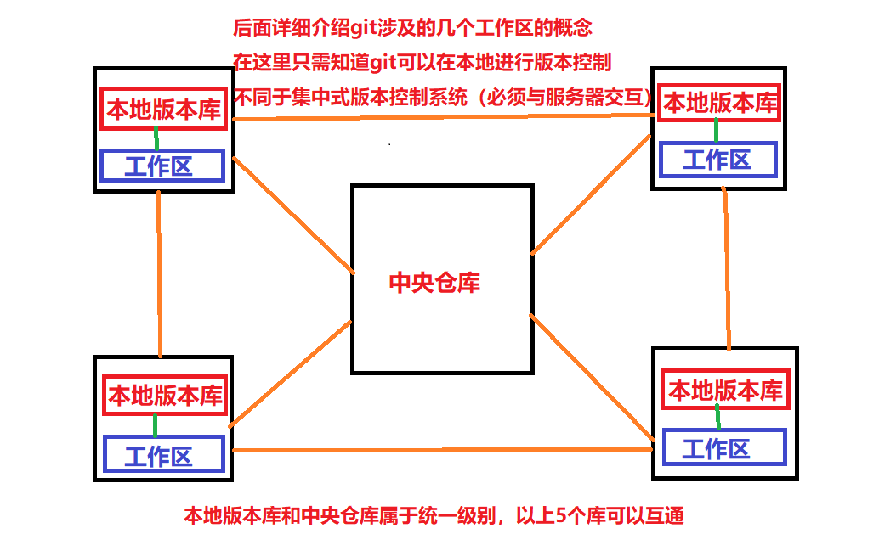

# 初识Git

## 1.版本控制软件

分布式版本控制软件

## 2.下载

官网：https://git-scm.com/

国内镜像：http://npm.taobao.org/mirrors/git-for-windows/（推荐：速度块）

**一键安装：一直下一步**

**或者安装时：Use git from git bash only...，其他默认下一步**

## 3.配置Path

bin目录配置到Path里面就可以了

```
D:\Git\bin
```

也可以不配置，配置以后可以在命令行窗口使用以及开发工具（例如：IDEA）中可以自动识别，如果不配置需要在开发工具（例如：IDEA）使用时进行手动配置本地git

## 4.配置用户名和邮箱

提交到仓库时，需要记录你的身份

右键打开Git Bash Here

分别执行以下两条命令

```bash
git config --global user.name "hzb-start"

git config --global user.email "344728800@qq.com"
```

配置完后，查看C盘用户目录，会有一个.gitconfig文件

```
[user]
	name = hzb-start
	email = 344728800@qq.com
```

## 5.配置SSH

为了在本地和远程仓库之间进行**免密钥登录**，可以**配置SSH**

我们先创建搭建git服务器（远程仓库）：**统一的托管网站（https://github.com/，或者https://gitee.com/（国内，推荐））**

需要分别在**本地**和**远程**操作

先在gitee官网注册账号

右键打开Git Bash Here，执行一条命令

```bash
ssh-keygen -t rsa -C 344728800@qq.com 
```

然后会在本地用户目录下生成.ssh文件夹，点进去会有一个id_rsa.pub文件

复制里面的内容

然后参考https://gitee.com/help/articles/4191#article-header0，配置SSH

也就是将本地刚才生成的id_rsa.pub内容复制到远程的Key中

测试连通，执行一条命令，出现成功提示即可

```bash
$ ssh -T git@gitee.com
Hi hzb-start! You've successfully authenticated, but GITEE.COM does not provide shell access.
```

如果本地和远程成功通信，则可以在/.ssh目录中发现known_hosts文件

如果失败：多尝试几次、检查回车符

## 6.创建本地、远程项目，并提交项目

### （1）在本地新建git项目

创建一个文件夹，点进去，在里面右键打开Git Bash Here

执行一条命令，当前文件夹就是一个git项目（可在电脑打开隐藏的项目：会出现.git文件夹）

```bash
git init
```

### （2）在远程建立git项目


### （3）提交项目

参考：https://gitee.com/help/articles/4122

## 7.本地仓库与中央仓库



## 8.基本命令

git add：将本地文件增加到暂存区

git commit：将暂存区的内容提交到本地仓库（本地分支，默认master分支）

git push：将本地仓库的内容推送到远程仓库（远程分支）

git pull：将远程仓库（远程分支）的内容拉取到本地仓库（本地分支）

