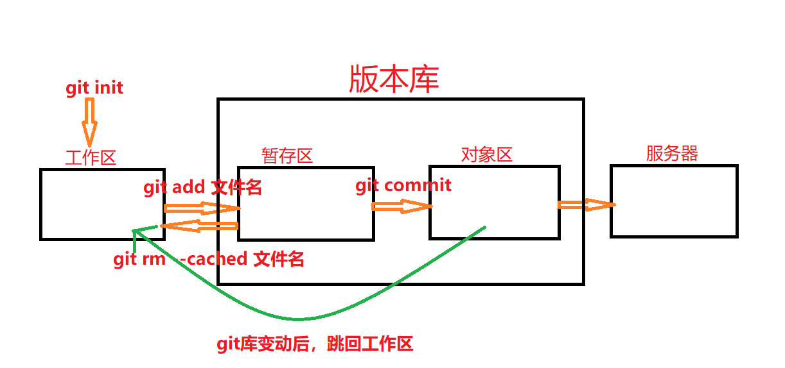

# Git的概述

## 1.基本概述

分布式版本控制系统

官网：https://git-scm.com/

## 2.优势

- 可以实现本地版本控制：在本地就可以进行版本控制

- 重写以后可以提交说明：每次提交，都可以对本次提交的东西，进行一个简单的阐述，作为记录

- 可以还原：提交的，修改的等都可以还原

- 实现了分支：根据客户不同的需求，可以有两个相近的版本

- 全量：每次修改后，对整个git控制的文件进行一次全备份（每个版本都包含全部文件，保持数据的完整性）

## 3.四种状态

- untracked：未跟踪，此文件未加入到git库，不参与版本控制（git init初始化一个git库，也就是工作区）
- unmodify：文件已入到git库中，未修改，文件内容与本地库的文件快照内容完全一致
- modified：文件已入到git库中，经过修改，文件内容与本地库的文件快照内容不一致
- staged：暂存状态

## 4.三个工作区域

git项目的三个工作区域的概念：**工作区、暂存区、对象区**

工作区：**git init**后就是工作区，顾名思义就是git可以对其进行控制

暂存区：**git add . **或者**git add 文件名**

对象区：**git commit**，对象区和服务器直接交互

