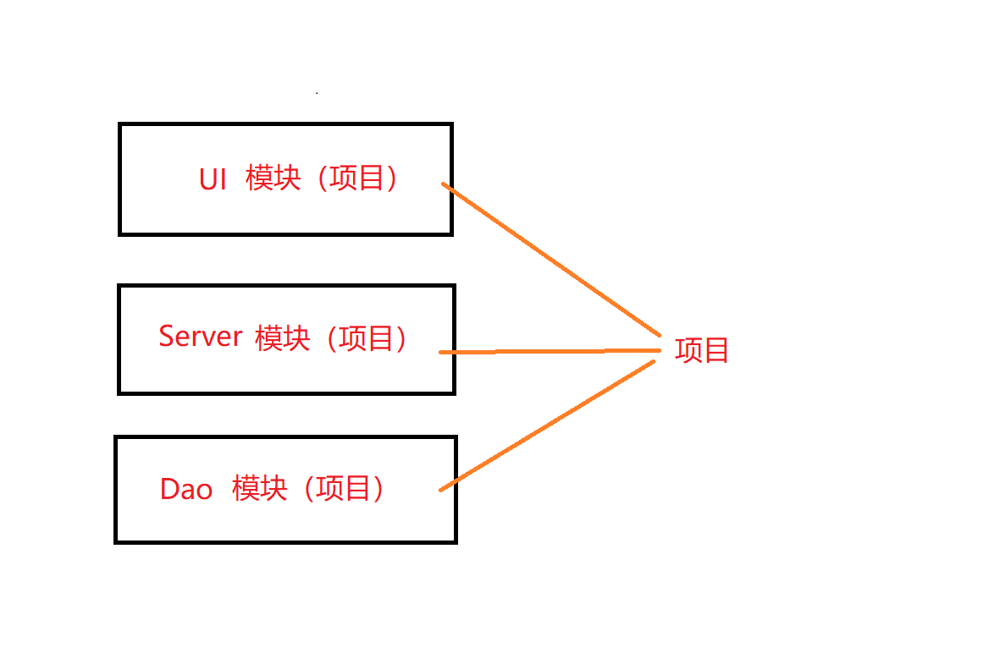
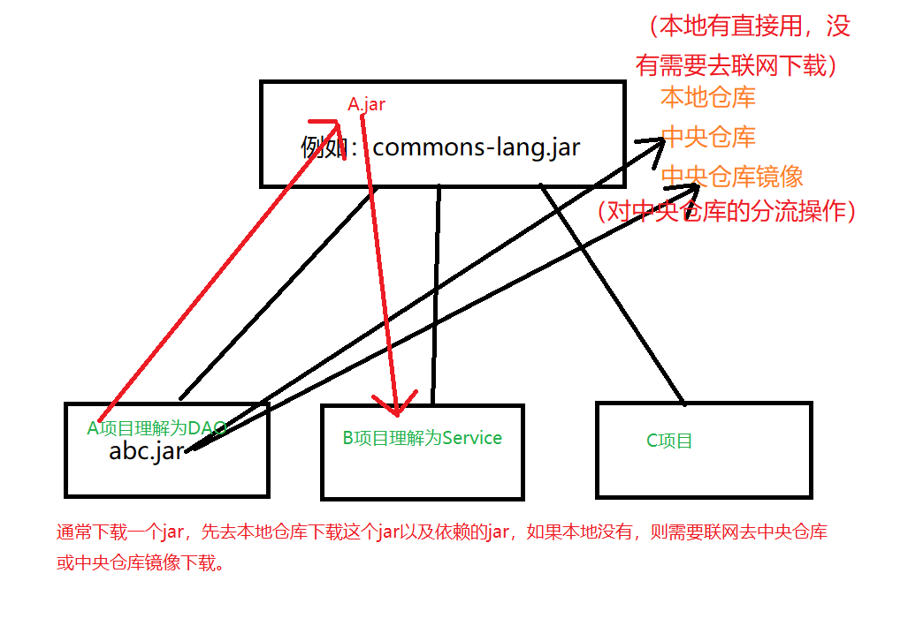
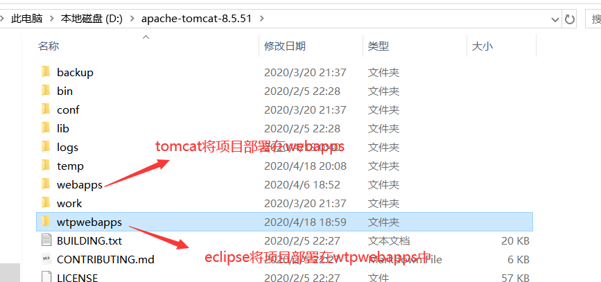
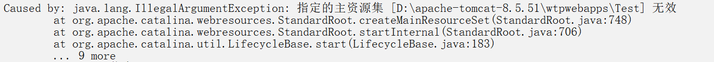
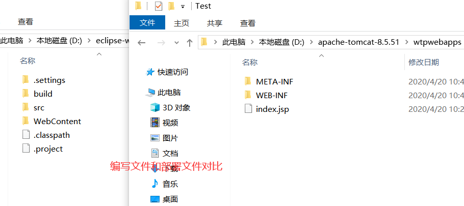
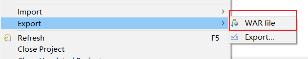
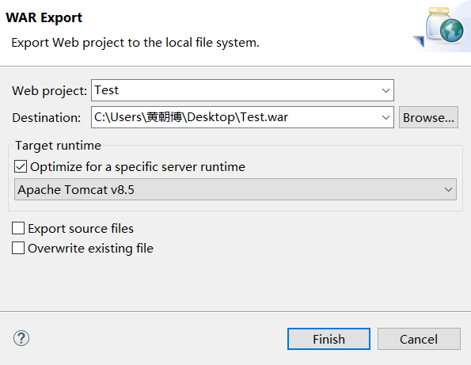
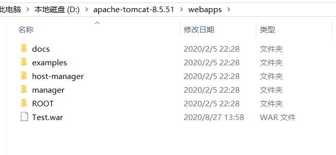
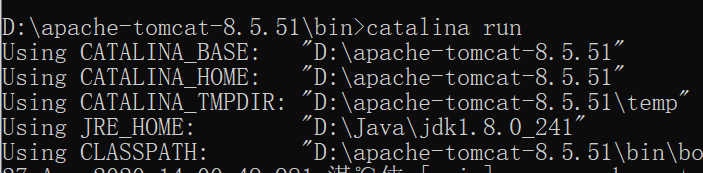
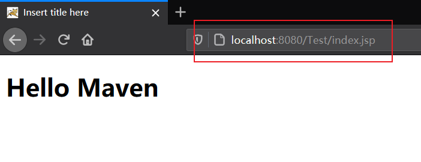

# 一、Maven概述

## 1.maven的作用

### （1）管理Jar

#### ①增加第三方Jar

例如下载上传时需要commons-fileupload.jar、commons-io.jar（fileupload不一定依赖io，版本不同会有差异）

#### ②jar包之间的依赖关系 

例如commons-fileupload.jar自动关联下载所有依赖的Jar，并且不会冲突

### （2）将项目拆分成若干个模块

每一层代码都很大，现在将项目分开，一个项目写UI、一个项目写Server、一个项目写Dao等，在maven中称之为模块

## 2.maven概念

是一个**基于Java平台**（使用依赖于java环境）的自动化构建工具，而eclipse是半自动化的构建工具

eclipse：java→class→执行（class过程我们看不到，因此它是半自动化的构建工具）

构建工具有：make→ant→maven（主流）→gradle（较新）

## 3.maven具体功能

清理：删除编译的结果，为重新编译做准备

编译：java→class

测试：针对于项目中的关键点进行测试，亦可用项目中的测试代码去测试开发代码

报告：将测试的结果进行显示

打包：将项目中包含的多个文件压缩成一个文件， 用于安装或部署（java项目→jar、web项目→war）

安装：将打成的包放到本地仓库，供其他项目使用

部署：将打成的包放到服务器上准备运行

也就是将java、html、css、js、jsp等各个文件进行筛选、组装，变成一个可以直接运行的项目（可发布的项目）

就好比大米→米饭

A项目开发DAO层，需要依赖abc.jar，此时本地仓库没有，需要去中央仓库（镜像）去下载

开发完后，将A项目安装到本地仓库，命名为A.jar，供B项目开发Service层去使用

（这里暂时对仓库的理解分为：本地仓库、中央仓库（以及镜像），在后面会对仓库概念进行补充说明）

## 4.注意

Eclipse中部署的web项目可以直接运行

将Eclipse中的项目，复制到tomcat/webapps中则不能运行

项目可以在webappas（并且可以发现项目**已经被Eclipse编译好**）中直接运行	

Eclipse中的项目，在部署时会生成一个对应的部署项目(在wtpwebapps中)，区别在于：部署项目没有源码文件src(java)，只有编译后的class文件和jsp文件

因为二者目录结构不一致，因此tomcat中无法直接运行Eclips中复制过来的项目 （因为如果要在tomcat中运行一个项目，则该项目必须严格遵循tomcat的目录结构）

Eclipse中的项目要在tomcat中运行，就需要部署（两种方法）

**a.通过Eclipse中Add and Remove按钮进行部署**

**b.将Web项目打成一个war包，然后将该war包复制到tomcat/webapps中即可执行运行**

**自动化构建工具maven：将原材料（java、js、css、html、图片）→产品（可发布项目）**

**Maven可以：编译→打包→部署→测试→自动构建**

将eclipse的项目文件复制到webapps（删除wtpwebapps里对应的项目），然后启动startup.bat，**项目部署失败**

通过命令行在tomcat的bin目录下运行**catalina run**来查看错误

eclipse部署的web项目可以运行

将eclipse的web项目复制到tomcat/webapps中则不能运行

而又有项目可以在webapps中直接运行

原因是**eclipse部署的文件和编写的文件完全不一样，部署的时候不需要java文件，只需要class（二者目录结构不一致，因此tomcat中无法直接运行eclipse复制过来的项目）**

## 5.eclipse项目移动到tomcat下运行

需要将项目（右击）打成war包，然后放到tomcat/webapps目录下

