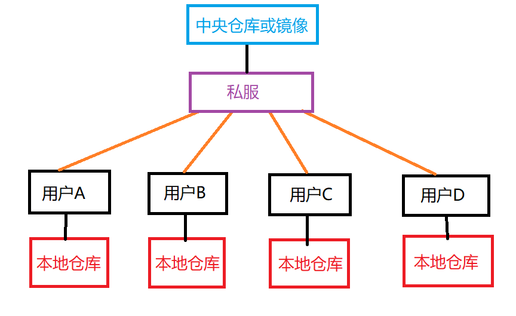
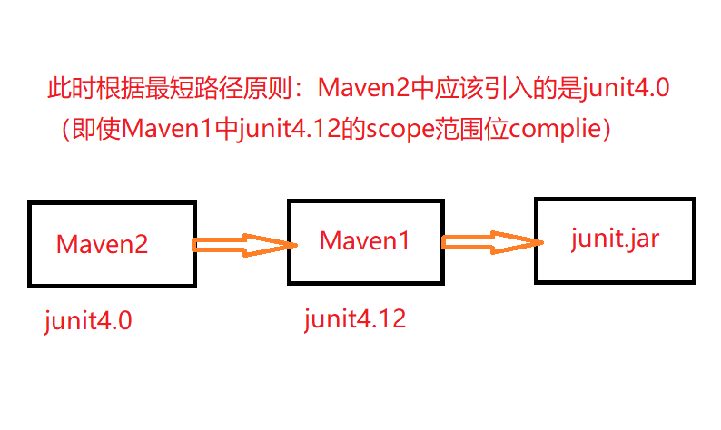
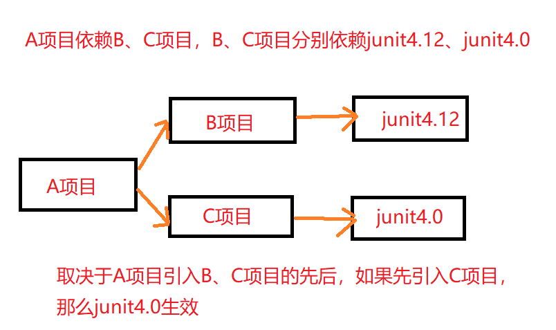

# Maven的私服、依赖补充

## 1.私服

补充一个私服的概念

私服也是一个管理jar包的仓库

如果将每台计算机都搭建一个本地仓库会造成资源的浪费，那么在公司的主计算机上就可以搭建一个私服供公司成员使用

寻找jar环境的顺序：**本地仓库→私服→中央仓库或镜像（私服、中央仓库或镜像也称为远程仓库）**




## 2.A.jar依赖B.jar

```xml
<dependency>
	<groupId>junit</groupId>
	<artifactId>junit</artifactId>
	<version>4.0</version>
	<scope>test</scope>
</dependency>
```

## 3.依赖的范围、有效性

compile(默认) 、test、provided

- 案例1

  junit是测试的一个工具包，如果将junit的范围变大，发布项目后会把junit的环境所依赖的jar附加到项目中，但是发布后，并不需要这些jar包，因此**maven就通过依赖范围**来去限制jar包什么时候生效（生效时，就将jar包和项目看成一个整体）

- 案例2

  servlet-api.jar，在编译和测试时会使用到doget、dopost方法，这两个方法就是这个jar包提供的，但是它在运行时就不需要这个jar包了，因为运行时，会启动tomcat，tomcat中有内置的servlet-api.jar

|                      | **compile** | **test** | **provided** |
| -------------------- | ----------- | -------- | ------------ |
| 编译                 | √           | ×        | √            |
| 测试                 | √           | √        | √            |
| **部署**（**运行**） | √           | ×        | ×            |

**Maven在编译、测试、运行项目时，各自使用一套classpath**

## 4.依赖的排除性

**假设一个情景**

A.jar依赖B.jar（依赖的本质：z.java用到了r.java的一些方法）

A.jar中有x.java、y.java、z.java

B.jar中有p.java、q.java、r.java

但是我们只需要用到x.java和y.java中的方法

**分析**

如果这种情景给出A的坐标让maven自动构建项目时，会引入整个B.jar，此时我们就需要排除无关的文件

**例子**

commons-fileupload-1.4.jar依赖commons-io-2.2.jar（其它版本不一定有这样的依赖关系）

```xml
<dependency>
	<groupId>commons-fileupload</groupId>
	<artifactId>commons-fileupload</artifactId>
   	<version>1.4</version>
</dependency>
```

再排除commons-io-2.2.jar

```xml
<dependency>
	<groupId>commons-fileupload</groupId>
	<artifactId>commons-fileupload</artifactId>
   	<version>1.4</version>
   	<exclusions>
   		<exclusion>
   			<groupId>commons-io</groupId>
            <artifactId>commons-io</artifactId>
    	</exclusion>
    </exclusions>
</dependency>
```

## 5.两个项目的依赖

将A项目先install到本地仓库

然后B项目通过坐标引入A项目

如果B和A的方法在同一个包中则不需要导B的包（满足约定）

多个maven项目一般称为多个模块

## 5.依赖的传递性

A.jar→B.jar→C.jar

要使A.jar→C.jar：当且仅当B.jar依赖于C.jar的范围必须是compile

**通过junit.jar演示**

项目Maven2引入项目Maven1的坐标

项目一：Maven1

pom.xml

```xml
<dependency>
	<groupId>junit</groupId>
	<artifactId>junit</artifactId>
	<version>4.12</version>
    <!--测试传递依赖  -->
    <!--compile可以实现依赖，其它则不可以  -->
	<scope>compile</scope>
    <!-- <scope>test</scope> -->	
</dependency>
```

项目而：Maven2

pom.xml

```xml
<dependencies>
	<!-- <dependency>
	<groupId>junit</groupId>
    <artifactId>junit</artifactId>
	<version>4.12</version>
    <scope>test</scope>
</dependency> -->
	
	<dependency>
		<groupId>nuc.hzb</groupId>
  		<artifactId>Maven1</artifactId>
  		<version>0.0.1-SNAPSHOT</version>
	</dependency>
	
</dependencies>
```

## 6.依赖的原则

### （1）最短路径

不用模块之间，如果出现这种情况，根据最短路径原则，本模块的pom.xml中是哪个jar的坐标就引入哪个jar



### （2）路径长度相同

#### ①相同的pom.xml

如果在同一个模块的pom.xml中出现相同的jar不同的版本，则**越靠后优先级则越高**，这种情况其实是一个错误做法，应及时更正

下面这种情景：3.8版本的junit生效

```
<dependency>
	<groupId>junit</groupId>
	<artifactId>junit</artifactId>
	<version>4.0</version>
    <scope>test</scope>
</dependency>

<dependency>
	<groupId>junit</groupId>
	<artifactId>junit</artifactId>
    <version>3.8</version>
	<scope>test</scope>    
</dependency>
```

#### ②不同的pom.xml

不具体演示

通过图解来理解

先引入指的是pom.xml文件中标签dependency指定的坐标靠前的jar

