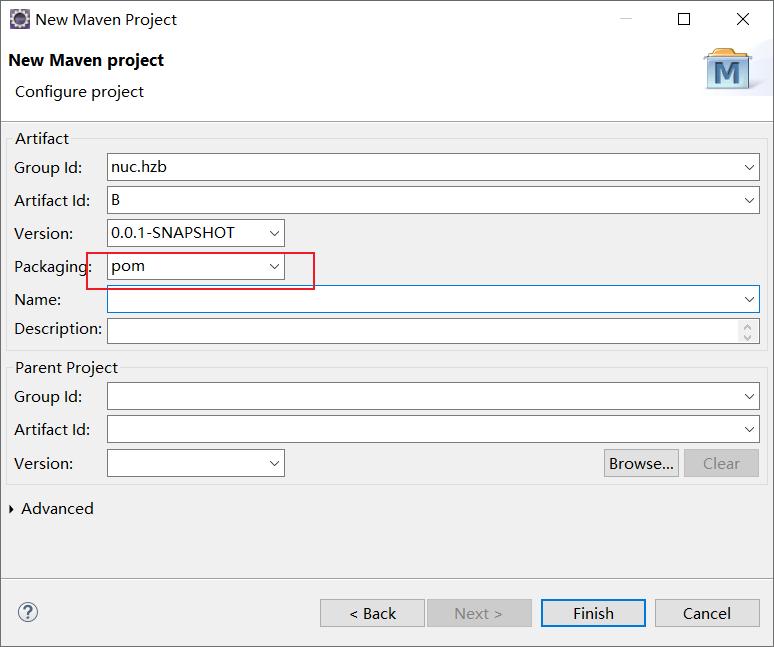

# Maven继承

## 1.继承的实现

为什么需要继承？

根据依赖我们可以知道，只有compile才可以实现依赖

如果A项目依赖B项目，如果通过**继承去实现**，那么A项目也可以获取B项目中所有依赖的jar，此时**不需要考虑依赖范围**

## 2.打包方式

java工程——jar

web项目——war

父工程——pom

## 3.继承实现步骤

> 1.建立父工程：父工程的打包方式为pom



**父工程的目录结构**

结构简单，没有类路径，就是一个普通的文件夹，我们只在这个B项目中写一些依赖的jar的坐标


> 2.在父工程的pom.xml中编写依赖

```xml
<!-- 父工程，父工程的依赖需要写在dependencyManagement标签里面-->
<dependencyManagement>
	<dependencies>
 		<dependency>
  			<groupId>junit</groupId>
  			<artifactId>junit</artifactId>
  			<version>4.0</version>
  			<scope>test</scope>
  		</dependency>	
  	</dependencies> 
</dependencyManagement>
```

> 3.子工程配置

由于B中可能依赖很多jar，所以需要在子工程声明所需包的g和a

**配置完以后需要更新Maven，eclipse的快捷键时Alt+F5**

```xml
<project xmlns="http://maven.apache.org/POM/4.0.0" xmlns:xsi="http://www.w3.org/2001/XMLSchema-instance" xsi:schemaLocation="http://maven.apache.org/POM/4.0.0 https://maven.apache.org/xsd/maven-4.0.0.xsd">
  <modelVersion>4.0.0</modelVersion>
   
  	<!--  继承一般g和v都一致-->
 	<!--  <groupId>nuc.hzb</groupId> -->
  	<artifactId>A</artifactId>
 	<!--  <version>0.0.1-SNAPSHOT</version> -->
 	
  	<parent>
  		<!--  给当前工程继承一个父工程-->
  		<groupId>nuc.hzb</groupId>
  		<artifactId>B</artifactId>
  		<version>0.0.1-SNAPSHOT</version>
  		
  		<!-- 当前工程的pom.xml到父工程pom.xml的相对路径 -->
  		<relativePath>../B/pom.xml</relativePath>
  	</parent>
  	<!--由于B中可能依赖很多jar，所以需要在子工程声明所需包的g和a-->
  	<dependencies>
  		<dependency>
  			<groupId>junit</groupId>
  			<artifactId>junit</artifactId>
  		</dependency>
  	</dependencies>
</project>
```

## 4.注意

如果是**继承关系**，必须先安装所依赖的父工程