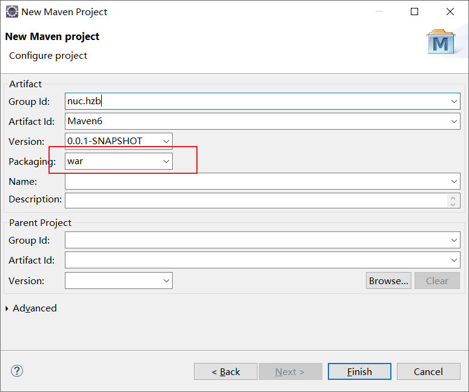
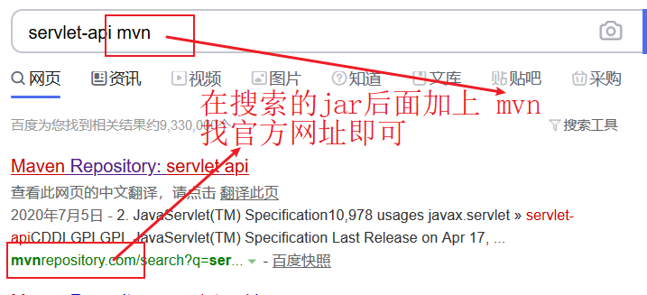

# 补充

## 1.web项目

web项目需要选择war方式的maven工程

不同的集成开发工具构建的项目目录结构存在差异，web项目仍然需要遵循一定的约定，例如WEB-INF下需要web.xml，如果构建的项目中目录结构存在差异，需要我们手动创建、修改正确

开发完后通过maven命令（package）打成war包交由部署人员去部署，当然在学习阶段我们也应该学会如何将项目部署到一台服务器上

还有一键部署方式，暂时不做了解

实际开发中，也是开发人员将自己的项目开发完毕后打成war包（package）交给实施人员去部署



## 2.Maven的中央仓库

maven的中央仓库存放大量jar包，我们在开始的学习中，会用到个别jar包可以去中央仓库去找

除非到后面spring系列的项目，我们会通过集成开发工具去构建项目，这是我们不需要自己去找jar包

官网：http://www.mvnrepository.com



## 3.配置镜像

主要时加快加载环境的速度，第一次下载jar包，maven需要去中央仓库，由于中央仓库在国外，我们可以通过镜像去下载

之前对镜像的概念已经解释，现在只需在配置中添加即可

D:\apache-maven-3.6.3\conf\settings.xml

setting.xml中寻找mirrors标签（Ctrl+F搜索）

配置两个镜像，防止意外，如果在下载依赖时还会出现错误，请将镜像注释掉，这种情况一般发生在需要下载不常用的jar包

```xml
<mirrors>
    <!-- mirror
     | Specifies a repository mirror site to use instead of a given repository. The repository that
     | this mirror serves has an ID that matches the mirrorOf element of this mirror. IDs are used
     | for inheritance and direct lookup purposes, and must be unique across the set of mirrors.
     |
    <mirror>
      <id>mirrorId</id>
      <mirrorOf>repositoryId</mirrorOf>
      <name>Human Readable Name for this Mirror.</name>
      <url>http://my.repository.com/repo/path</url>
    </mirror>
     -->
	 
	

		<mirror>
			<id>nexus-aliyun</id>
			<mirrorOf>central</mirrorOf>
			<name>Nexus aliyun</name>
			<url>http://maven.aliyun.com/nexus/content/groups/public</url>
		</mirror>
		
		<mirror>
			<id>maven-net-cn</id>
			<mirrorOf>central</mirrorOf>
			<name>Maven China Mirror</name>
			<url>http://maven.net.cn/content/groups/public/</url>
		</mirror>

  
  </mirrors>
```


